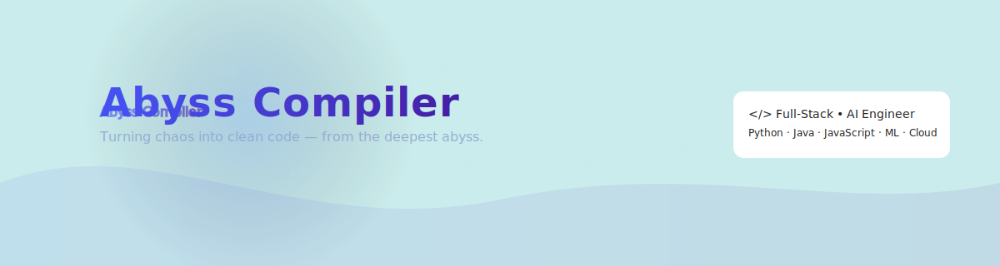

  <picture>
    <source media="(prefers-color-scheme: dark)" srcset="./header-dark.svg">
    <source media="(prefers-color-scheme: light)" srcset="./header-light.svg">
    
  </picture>

<!-- Title -->
<h1 align="center">
  
</h1>
<h3 align="center">Full-Stack Developer | AI Engineer | Automation Expert</h3>

<!-- Badges -->

  
  

---

## 🛠️ Tech Stack

### **Languages**

  

### **Frameworks & Libraries**

  

### **AI & Automation**

  
  
  
  
  

### **Tools & Platforms**

  

---

## 📊 GitHub Stats & Activity

  <!-- GitHub Stats -->
  
  
  <!-- Top Languages -->
  

  <!-- Contribution Streak -->
  

  <!-- Trophies -->
  

## 🐍 Contribution Snake

  <picture>
    <source media="(prefers-color-scheme: dark)" srcset="https://github.com/AbyssCompiler/AbyssCompiler/blob/output/github-snake-dark.svg" />
    <source media="(prefers-color-scheme: light)" srcset="https://github.com/AbyssCompiler/AbyssCompiler/blob/output/github-snake-light.svg" />
    
  </picture>

---

## 📬 Contact Me

  
  
  

---

  <i>☀️ Turning chaos into clean code — from the deepest abyss.</i>

